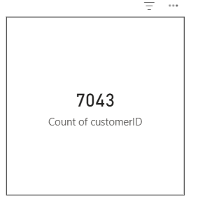
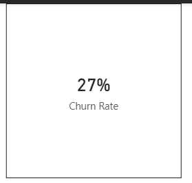
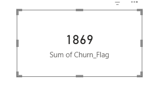
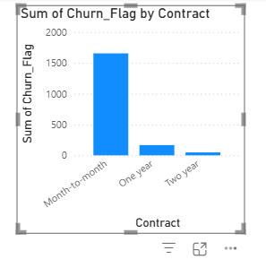

# Customer Churn Analysis (SQL Server + Power BI)

## Overview
This project performs an end-to-end **customer churn analysis** using **SQL Server** for data querying and **Power BI** for visualization.  
The goal is to identify churn patterns, calculate churn rate, and analyze churn behavior across customer contracts.

This project simulates a real-world analytics workflow used in data analyst and business intelligence roles.

---

## Tech Stack
- SQL Server (SSMS)
- SQL (Joins, Aggregations, CASE, Views)
- Power BI
- DAX (Measures, Calculated Columns)
- Data Visualization

---

## Dataset
- Customer subscription dataset
- Key fields:  
  `customerID`, `Churn`, `Contract`, `MonthlyCharges`, `InternetService`, etc.

---

## SQL Work
The following tasks were performed in SQL Server:

- Data cleaning and validation
- Churn flag creation
- Aggregation queries for churned vs retained customers
- Contract-wise churn analysis
- KPI-ready query outputs for Power BI

---

## Power BI Dashboard

### KPI Cards

### Churn Analysis

---

## Key Insights
- Month-to-month contracts show the highest churn
- Long-term contracts significantly reduce churn
- Overall churn rate is approximately **27%**

---

## Project Status
✅ Completed analytics & dashboard  
🔜 Future scope: Churn prediction using Machine Learning

---

## Author
**Pooja Sri Satya**  
B.Tech CSE (6th Semester)  
